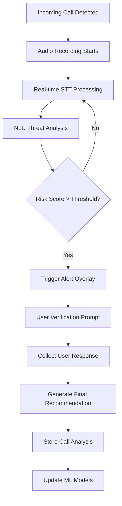

## 1. Product Overview
A real-time Voice AI Assistant that protects mobile phone users from social engineering, financial fraud, and impersonation scams by analyzing live call audio and providing instant security warnings. The system runs silently in the background, detecting fraudulent patterns and alerting users without the caller's knowledge.

**Target Market:** Mobile users concerned about phone-based scams, financial institutions offering customer protection, and enterprise security solutions.

## 2. Core Features

### 2.1 User Roles
| Role | Registration Method | Core Permissions |
|------|---------------------|------------------|
| Basic User | Phone number + OTP | Real-time call protection, basic risk alerts, call history |
| Premium User | Subscription upgrade | Advanced threat detection, detailed analytics, priority support |
| Enterprise Admin | Corporate onboarding | Multi-user management, organization-wide policies, compliance reporting |

### 2.2 Feature Module
The Voice AI Security system consists of the following main interfaces:
1. **Call Protection Dashboard**: Real-time monitoring status, active call indicators, risk level display
2. **Security Alert Overlay**: Interruptive warnings, verification prompts, action recommendations
3. **Call History & Analytics**: Past call analysis, threat patterns, blocking management
4. **Settings & Configuration**: Risk sensitivity levels, trusted contacts, privacy controls

### 2.3 Page Details
| Page Name | Module Name | Feature description |
|-----------|-------------|---------------------|
| Call Protection Dashboard | Status Monitor | Display current protection status, show active call detection, indicate real-time risk level with color-coded alerts |
| Call Protection Dashboard | Quick Actions | Enable/disable protection, access emergency features, view recent alerts |
| Security Alert Overlay | Risk Warning | Show high-priority alerts with vibration/sound, display threat type and confidence score, provide immediate action buttons |
| Security Alert Overlay | Verification Prompt | Ask user to confirm caller identity, provide multiple choice responses, collect user feedback for ML improvement |
| Call History & Analytics | Call Log | List all processed calls with risk scores, filter by threat level, show transcript snippets for high-risk calls |
| Call History & Analytics | Threat Analysis | Display detected scam patterns, show common attack vectors, provide educational content about threats |
| Call History & Analytics | Block Management | View/manage blocked numbers, add custom block rules, import/export block lists |
| Settings & Configuration | Risk Sensitivity | Adjust detection thresholds, customize alert types, set quiet hours for alerts |
| Settings & Configuration | Privacy Controls | Manage data retention, control transcript storage, configure cloud sync options |
| Settings & Configuration | Trusted Contacts | Mark safe numbers, import from contacts, set VIP bypass rules |

## 3. Core Process

### User Protection Flow
1. **Call Initiation**: System detects incoming call and begins background audio recording
2. **Real-time Analysis**: STT engine converts speech to text with <500ms latency
3. **Threat Detection**: NLU model analyzes transcript for fraud indicators every 2-3 seconds
4. **Risk Scoring**: Dynamic algorithm updates threat level based on linguistic patterns and caller behavior
5. **User Alert**: When threshold exceeded, overlay appears silently on user's screen
6. **User Response**: User interacts with verification prompts without caller awareness
7. **Final Recommendation**: System provides actionable intelligence based on combined AI analysis and user input

### Enterprise Admin Flow
1. **Dashboard Access**: View organization-wide protection statistics
2. **Policy Configuration**: Set risk thresholds and alert policies for user groups
3. **Threat Intelligence**: Review aggregated threat data and emerging attack patterns
4. **Compliance Reporting**: Generate security incident reports and audit trails

## 4. User Interface Design

### 4.1 Design Style
- **Primary Colors**: Deep security blue (#1E3A8A) for trust, warning orange (#F59E0B) for alerts, success green (#10B981) for safe calls
- **Button Style**: Rounded corners with subtle shadows, high contrast for accessibility
- **Typography**: System fonts for native feel, 16px base size, clear hierarchy with font weights
- **Layout**: Card-based design with swipe gestures, minimal visual clutter for quick decision making
- **Icons**: Material Design icons for consistency, animated indicators for real-time status

### 4.2 Page Design Overview
| Page Name | Module Name | UI Elements |
|-----------|-------------|-------------|
| Call Protection Dashboard | Status Monitor | Circular progress indicator showing protection status, pulsing animation when active call detected, color-coded risk meter with smooth transitions |
| Security Alert Overlay | Risk Warning | Full-screen translucent overlay with prominent warning icon, vibration feedback, large touch-friendly buttons for quick responses |
| Call History & Analytics | Call Log | Chronological list with swipe-to-block gestures, expandable cards showing transcript highlights, visual threat indicators |
| Settings & Configuration | Risk Sensitivity | Slider controls with live preview, toggle switches with clear on/off states, contextual help tooltips |

### 4.3 Responsiveness
Mobile-first design with native platform integration. Touch-optimized interface with gesture controls. Supports both portrait and landscape orientations with adaptive layouts.

### 4.4 Real-time Processing Requirements
- **Audio Latency**: <100ms from microphone to processing pipeline
- **STT Response**: <500ms for transcription with speaker diarization
- **NLU Analysis**: <200ms for threat pattern matching
- **UI Update**: <50ms for overlay rendering to avoid user detection delays