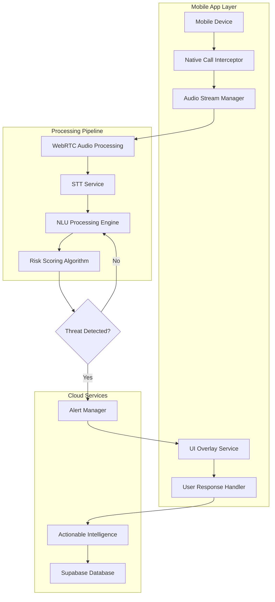
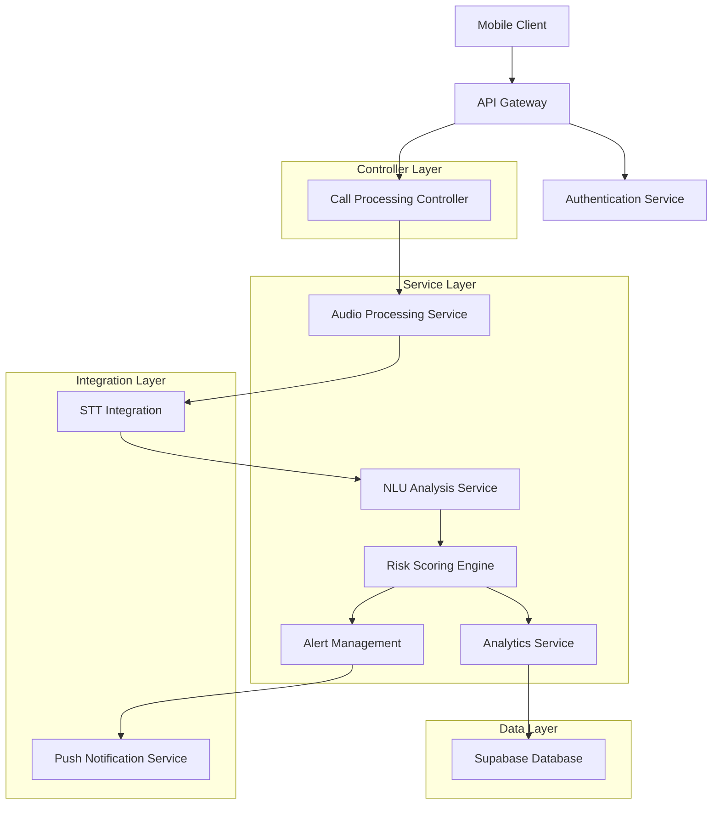
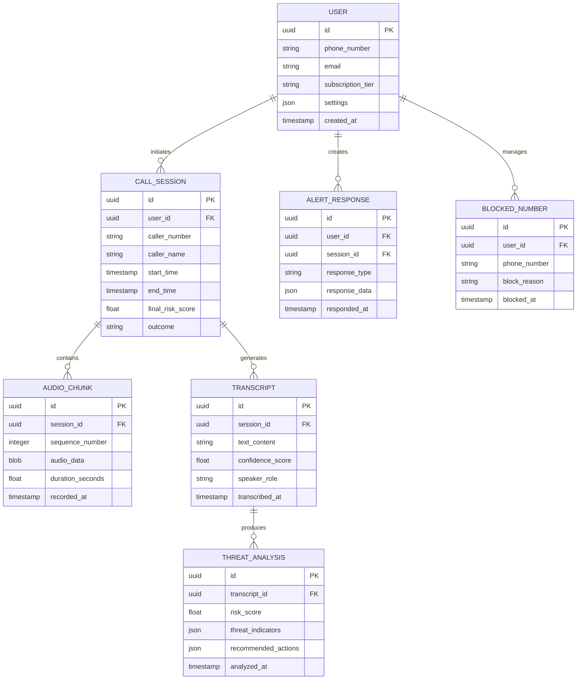
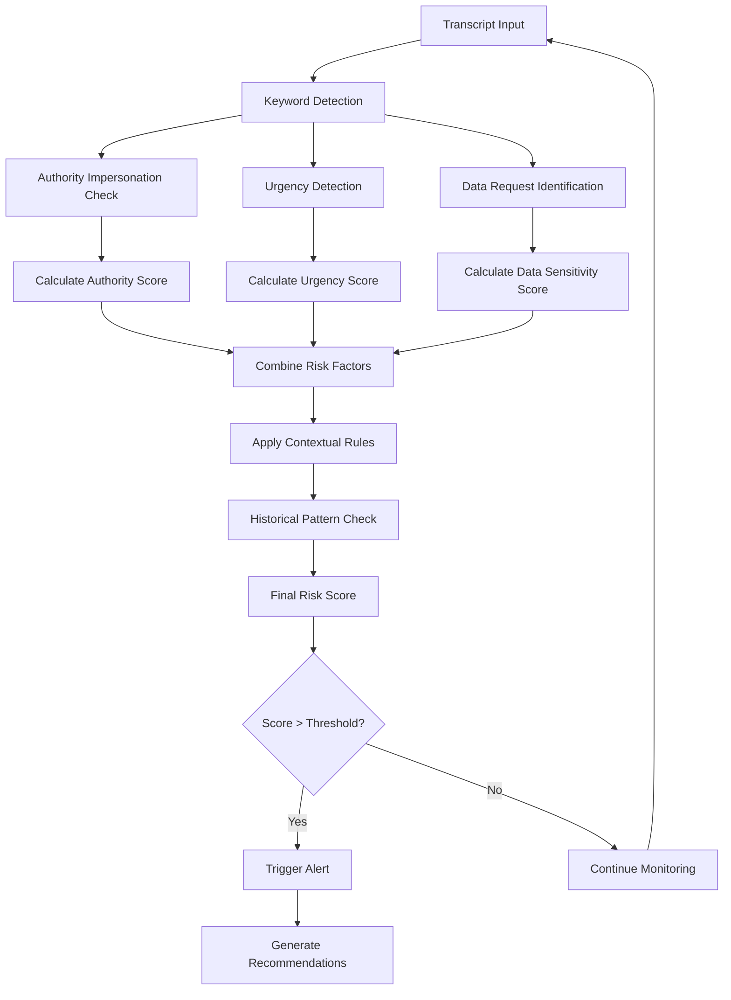

## 1. Architecture Design



## 2. Technology Description

- **Frontend**: React Native@0.72 + TypeScript@5 + Native Modules
- **Initialization Tool**: React Native CLI
- **Backend**: Node.js@18 + Express@4 + WebSocket Server
- **Database**: Supabase (PostgreSQL) + Redis Cache
- **STT Service**: Google Cloud Speech-to-Text API + Azure Cognitive Services (fallback)
- **NLU Engine**: Custom TensorFlow.js models + Hugging Face transformers
- **Real-time Communication**: Socket.io + WebRTC
- **Audio Processing**: Web Audio API + Native Android/iOS audio frameworks

## 3. Route Definitions

| Route | Purpose |
|-------|---------|
| /api/calls/start | Initialize call recording and analysis session |
| /api/calls/audio-stream | WebSocket endpoint for real-time audio data |
| /api/analysis/transcript | Submit audio chunks for STT processing |
| /api/analysis/threat | Analyze transcript for fraud indicators |
| /api/alerts/trigger | Send high-priority alerts to user device |
| /api/user/response | Process user verification responses |
| /api/reports/intelligence | Generate actionable intelligence reports |
| /api/settings/configure | Update user risk sensitivity settings |

## 4. API Definitions

### 4.1 Call Session Management
```
POST /api/calls/start
```

Request:
| Param Name | Param Type | isRequired | Description |
|------------|-------------|-------------|-------------|
| user_id | string | true | Unique user identifier |
| caller_number | string | true | Incoming phone number |
| timestamp | datetime | true | Call start time |
| device_id | string | true | Mobile device identifier |

Response:
| Param Name | Param Type | Description |
|------------|-------------|-------------|
| session_id | string | Unique call session identifier |
| status | string | Session initialization status |
| ws_url | string | WebSocket connection URL |

### 4.2 Real-time Audio Processing
```
WebSocket /api/calls/audio-stream
```

Message Format:
```json
{
  "session_id": "call_12345",
  "audio_chunk": "base64_encoded_audio_data",
  "chunk_sequence": 1,
  "timestamp": "2024-01-01T12:00:00Z",
  "sample_rate": 16000
}
```

### 4.3 Threat Analysis
```
POST /api/analysis/threat
```

Request:
| Param Name | Param Type | isRequired | Description |
|------------|-------------|-------------|-------------|
| session_id | string | true | Call session identifier |
| transcript | string | true | STT generated text |
| confidence | float | true | STT confidence score |
| speaker_id | string | false | Identified speaker |

Response:
| Param Name | Param Type | Description |
|------------|-------------|-------------|
| risk_score | float | Calculated threat level (0-100) |
| threat_types | array | Array of detected threat categories |
| urgency_level | string | Low/Medium/High/CRITICAL |
| recommended_action | string | Suggested user response |

## 5. Server Architecture Diagram



## 6. Data Model

### 6.1 Entity Relationship Diagram


### 6.2 Data Definition Language

**Users Table**
```sql
CREATE TABLE users (
  id UUID PRIMARY KEY DEFAULT gen_random_uuid(),
  phone_number VARCHAR(20) UNIQUE NOT NULL,
  email VARCHAR(255) UNIQUE,
  subscription_tier VARCHAR(20) DEFAULT 'basic' CHECK (subscription_tier IN ('basic', 'premium', 'enterprise')),
  settings JSONB DEFAULT '{}',
  created_at TIMESTAMP WITH TIME ZONE DEFAULT NOW(),
  updated_at TIMESTAMP WITH TIME ZONE DEFAULT NOW()
);

CREATE INDEX idx_users_phone ON users(phone_number);
CREATE INDEX idx_users_subscription ON users(subscription_tier);
```

**Call Sessions Table**
```sql
CREATE TABLE call_sessions (
  id UUID PRIMARY KEY DEFAULT gen_random_uuid(),
  user_id UUID REFERENCES users(id) ON DELETE CASCADE,
  caller_number VARCHAR(20) NOT NULL,
  caller_name VARCHAR(100),
  start_time TIMESTAMP WITH TIME ZONE NOT NULL,
  end_time TIMESTAMP WITH TIME ZONE,
  final_risk_score FLOAT CHECK (final_risk_score >= 0 AND final_risk_score <= 100),
  outcome VARCHAR(50) CHECK (outcome IN ('safe', 'blocked', 'user_ended', 'caller_ended', 'network_error')),
  created_at TIMESTAMP WITH TIME ZONE DEFAULT NOW()
);

CREATE INDEX idx_sessions_user_id ON call_sessions(user_id);
CREATE INDEX idx_sessions_start_time ON call_sessions(start_time DESC);
CREATE INDEX idx_sessions_risk_score ON call_sessions(final_risk_score DESC);
```

**Threat Analysis Table**
```sql
CREATE TABLE threat_analysis (
  id UUID PRIMARY KEY DEFAULT gen_random_uuid(),
  session_id UUID REFERENCES call_sessions(id) ON DELETE CASCADE,
  transcript_id UUID REFERENCES transcripts(id) ON DELETE CASCADE,
  risk_score FLOAT NOT NULL CHECK (risk_score >= 0 AND risk_score <= 100),
  threat_indicators JSONB NOT NULL,
  recommended_actions JSONB NOT NULL,
  analyzed_at TIMESTAMP WITH TIME ZONE DEFAULT NOW()
);

CREATE INDEX idx_threat_session_id ON threat_analysis(session_id);
CREATE INDEX idx_threat_risk_score ON threat_analysis(risk_score DESC);

-- Grant permissions
GRANT SELECT ON ALL TABLES TO anon;
GRANT ALL PRIVILEGES ON ALL TABLES TO authenticated;
```

## 7. Risk Assessment Engine Logic Flow



**Risk Scoring Algorithm Components:**
- **Authority Impersonation**: Bank names, government agencies, tech companies (+20-40 points)
- **Urgency Markers**: "immediate action", "limited time", "account closure" (+15-30 points)
- **Data Requests**: OTP, password, SSN, credit card (+25-50 points)
- **Linguistic Patterns**: Pressure tactics, fear appeals, authority language (+10-25 points)
- **Caller Reputation**: Known scam numbers, spoofed caller ID (+30-50 points)
- **Conversation Context**: Time of day, call duration, response patterns (+5-15 points)