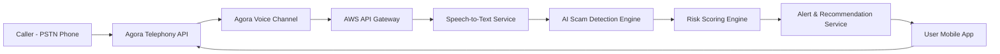

# SentiCall
### AI-Powered Real-Time Voice Scam Detection Assistant

**Team DASH 2**

| | |
|---|---|
| Kenneth Hular | Tymothy Fernandez |
| Marc Daniel Enguero | Kyle Evardome |

---

## 1. Project Overview

SentiCall is an AI-powered voice security assistant that detects potential scam calls in real time. The system monitors phone call conversations, analyzes speech patterns and dialogue context, and warns users when suspicious activity is detected.

Traditional spam filters rely primarily on phone number blacklists, which are ineffective against scammers who frequently use spoofed or newly generated numbers. SentiCall addresses this by analyzing the **content and behavior of the conversation itself**.

The system uses real-time voice streaming via **Agora** and cloud-based AI processing through **Amazon Web Services (AWS)** to detect scam indicators such as impersonation attempts, OTP requests, or urgent financial demands.

---

## 2. Problem Statement

Voice phishing (vishing) attacks are becoming increasingly prevalent worldwide. Fraudsters impersonate banks, government agencies, delivery services, or technical support representatives to obtain sensitive information from victims.

Common scam strategies include:

- Requesting OTP codes or authentication credentials
- Impersonating financial institutions
- Creating urgency to pressure victims
- Requesting immediate payments or transfers

Current systems provide limited protection because they only block known numbers rather than analyzing conversation behavior. A proactive solution is required to detect suspicious activity **during the call itself**.

---

## 3. Proposed Solution

SentiCall introduces a real-time AI monitoring system that operates during phone calls. It captures call audio, converts speech to text, analyzes the conversation using AI models, and identifies patterns commonly associated with scams.

Key capabilities:

- Real-time scam detection during calls
- Speech-to-text transcription
- AI-based scam pattern recognition
- User verification prompts
- Preventive security recommendations

---

## 4. System Actors

| Actor | Description |
|-------|-------------|
| **A – Phone Receiver** | The user receiving the call |
| **B – Caller** | The person initiating the call (may be legitimate or a scammer) |
| **C – Voice AI Assistant** | SentiCall system that monitors and analyzes the conversation |

---

## 5. Sample Scenario

A user receives a phone call from an unknown number. SentiCall activates automatically and monitors the conversation in real time.

**Step 1 – Call Initiation**
Caller B contacts User A.

**Step 2 – AI Monitoring**
The system records the conversation and converts speech into a transcript.

```
Caller: Hello, this is your bank security department.
        We detected suspicious activity on your account.
        Please provide the OTP sent to your phone.
```

**Step 3 – Scam Pattern Detection**
The AI identifies suspicious signals:
- Impersonation of a financial institution
- Request for OTP codes
- Urgency or pressure tactics

**Step 4 – User Alert**

```
⚠ Potential Scam Detected

The caller is requesting sensitive authentication codes.
Legitimate banks do not request OTP codes over the phone.
```

**Step 5 – Verification Prompt**

```
Do you recognize this caller or were you expecting this call?
```

**Step 6 – Preventive Action**
If the user confirms the call is suspicious, SentiCall suggests:
- End the call
- Avoid sharing personal information
- Block or report the number

---

## 6. System Architecture

SentiCall integrates **Agora voice communication** with **AWS cloud AI services**.



---

## 7. Telephony Integration

SentiCall integrates with the **Agora Conversational AI Telephony REST API** to connect traditional phone calls with AI processing services. This allows PSTN or SIP calls to be routed into an Agora channel for real-time audio analysis.

> Reference: [Agora Telephony REST API Docs](https://docs.agora.io/en/conversational-ai/rest-api/telephony/start)

---

## 8. Key Features

| Feature | Description |
|---------|-------------|
| Real-Time Scam Detection | Analyzes conversations during calls to detect fraudulent behavior |
| Speech-to-Text Transcription | Converts call audio into text for analysis |
| Scam Pattern Recognition | Identifies OTP requests, financial impersonation, urgency language, and payment demands |
| User Verification | Prompts the user to confirm whether the call is expected |
| Preventive Recommendations | Suggests actions to prevent fraud and protect the user |

---

## 9. Business Model

SentiCall follows a multi-sided platform model serving telecom companies, financial institutions, government agencies, and individual consumers.

### 9.1 Enterprise Monetization

| Customer Type | Product | Price |
|---------------|---------|-------|
| Telecom companies | Scam detection API | ₱0.50 – ₱1 per call |
| Banks / fintech | Fraud protection integration | ₱10 – ₱20 per user/month |
| Government agencies | National fraud intelligence dashboard | ₱1M+ yearly |

### 9.2 Consumer Freemium Model

| Plan | Features | Price |
|------|----------|-------|
| Free | Basic scam detection | ₱0 |
| Pro | Real-time detection + transcript analysis | ₱199/month |
| Family | Up to 5 protected users | ₱399/month |

---

## 10. Expected Impact

SentiCall aims to:

- Reduce phone scam victims
- Improve public cybersecurity awareness
- Provide real-time fraud protection
- Assist telecom providers and banks in preventing scams

---

## 11. Future Enhancements

- Deepfake voice scam detection
- Scam voice fingerprint analysis
- Automated fraud reporting systems
- Telecom-level scam call blocking
- Global fraud intelligence sharing

---

## 12. Conclusion

SentiCall demonstrates how Voice AI can be leveraged to combat one of the fastest-growing cybersecurity threats: voice phishing. By integrating real-time communication technology with AI-driven fraud detection, SentiCall provides users with immediate protection against scam calls and helps organizations strengthen their fraud prevention capabilities.
