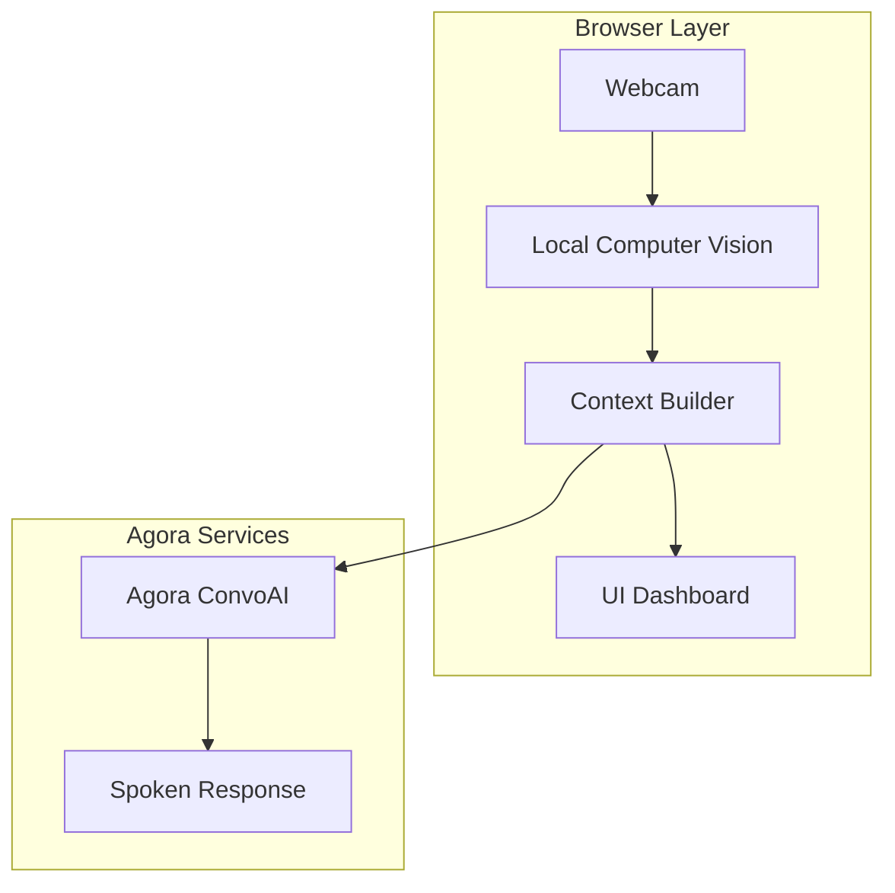
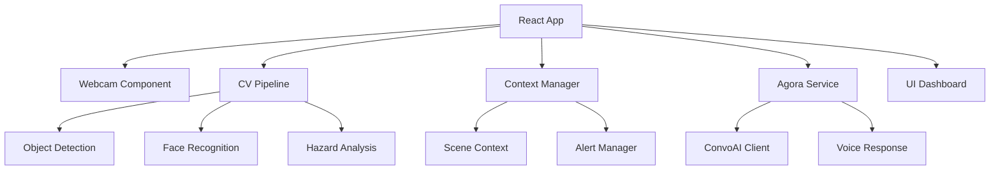

# VisionVoice Architecture

## 1. High-Level System Design



## 2. Frontend Architecture



## 3. Computer Vision Pipeline

### Object Detection
- **Library**: `@tensorflow-models/coco-ssd`
- **Purpose**: Detect everyday objects (chairs, tables, stairs, doors)
- **Frequency**: 2-3 FPS to balance performance and battery
- **Output**: Bounding boxes with confidence scores

### Face Recognition  
- **Library**: `@vladmandic/face-api`
- **Scope**: Pre-registered known contacts only
- **Privacy**: Opt-in, local processing only
- **Output**: Person identity with confidence

### Hazard Analysis
- **Input**: Object detections + spatial analysis
- **Logic**: Proximity-based threat assessment
- **Triggers**: Objects within 1-2 meter virtual zone
- **Output**: Hazard flag with direction/distance

## 4. Context Builder

Converts raw CV detections into concise assistive context:

```typescript
interface SceneContext {
  hazards: Array<{
    type: string
    direction: string  
    distance: string
    urgency: 'low' | 'medium' | 'high'
  }>
  knownPeople: Array<{
    name: string
    confidence: number
  }>
  pathClear: boolean
  summary: string
}
```

## 5. Agora ConvoAI Integration

### Request Flow
1. Scene context compiled every 500ms
2. Context sent to ConvoAI when:
   - Proactive: Hazard detected
   - Reactive: User asks question
   - Manual: User requests scene description

### Response Rules
- Maximum 1 sentence per response
- Calm, directive language
- Directional guidance (left, right, ahead)
- Confidence indicators when uncertain

### Voice Commands
- "What's in front of me?"
- "Is the path clear?"  
- "Who is here?"
- "Call [contact name]" (escalation)
- Safeword: "Help" or "Emergency"

## 6. UI Dashboard Structure

```
┌─────────────────────────────────────────────┐
│ Status Bar [Camera] [CV] [Agora] [Battery] │
├─────────────────┬───────────────────────────┤
│                 │                           │
│  Webcam Feed    │    Scene Summary          │
│                 │    ────────────────       │
│  [Live Preview] │    Hazards: 2             │
│                 │    People: Angela         │
│                 │    Path: Clear              │
│                 │                           │
├─────────────────┼───────────────────────────┤
│                 │                           │
│  Detected       │    Transcript              │
│  Objects        │    ────────────────       │
│  ────────────   │    "Chair ahead left"     │
│  Chair (85%)    │    "Path is clear"        │
│  Person (92%)   │                           │
│                 │                           │
└─────────────────┴───────────────────────────┘
```

## 7. Data Flow

### Proactive Mode
```
Webcam → CV Detection → Hazard Check → Context Builder → Agora ConvoAI → Speech
```

### Reactive Mode  
```
User Voice → Agora ConvoAI → Context Request → Context Builder → Response → Speech
```

### Escalation Mode
```
Voice Command/ Safeword → Agora Call → Caregiver Joins → Live A/V Feed
```

## 8. MVP Boundaries

**Included:**
- Object detection for common obstacles
- Known person recognition (opt-in)
- Proactive hazard alerts
- Reactive voice questions
- Basic caregiver escalation

**Excluded:**
- Full navigation guidance
- Medical device features
- Public face recognition
- Complex multi-agent systems
- Route planning algorithms

## 9. Performance Targets

- **Webcam**: 30 FPS preview
- **Object Detection**: 2-3 FPS processing
- **Voice Response**: <2 second latency
- **Face Recognition**: <1 second for known contacts
- **Memory Usage**: <500MB total

## 10. Fallback Strategy

### CV Failures
- Graceful degradation to audio-only mode
- Pre-recorded generic alerts for common hazards
- User can request manual scene description

### Agora Failures  
- Local text-to-speech backup
- Visual transcript remains available
- Caregiver escalation via phone/SMS

### Demo Safeguards
- Pre-loaded test scenarios
- Manual trigger buttons
- Confidence threshold tuning
- Quick reset functionality